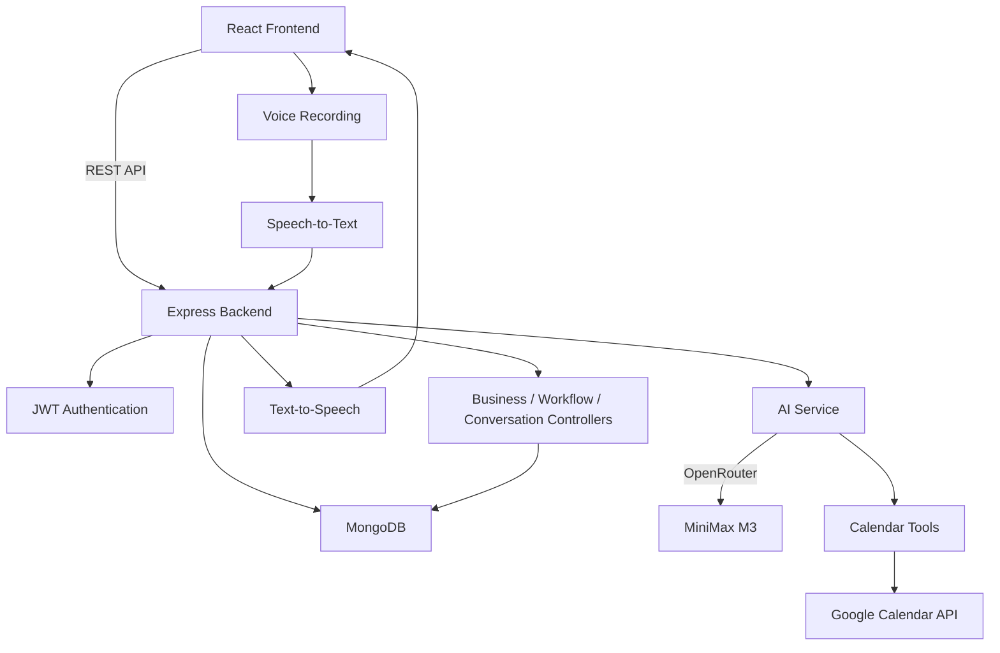

# CallFlow AI – Voice AI Personal Assistant

A configurable AI personal assistant for small businesses that helps handle missed-call customer conversations, collect customer information, perform follow-up actions, manage appointments through Google Calendar, and support voice-based AI conversations.

## Features

### Business Profile
* Create a business profile with:
  - Business name
  - Business type
  - Phone number
  - Description

### Custom Workflow Builder
Business owners can create and modify workflows without changing the core application.

Each workflow supports:
* Workflow name
* Missed-call trigger
* Greeting/opening message
* Custom information fields
* Required and optional fields
* Conditional branches
* Action after information collection
* Closing message
* Follow-up status

### AI Conversation Simulator
The application provides a working text-based and voice-based AI conversation simulator.

The AI:
* Follows the configured workflow
* Collects customer information
* Understands customer intent
* Extracts captured information
* Generates conversation responses
* Performs configured actions
* Maintains the conversation transcript

### Voice Conversation Support

The AI receptionist supports voice-based conversations in addition to text mode.

The voice flow works as follows:

```text
User Speech
       ↓
Audio Recording
       ↓
Speech-to-Text
       ↓
AI Conversation Processing
       ↓
AI Response
       ↓
Text-to-Speech
       ↓
Voice Response
```

Speech-to-Text and Text-to-Speech are implemented using external AI services rather than browser speech-recognition APIs.

### Speech-to-Text

User audio is recorded and sent to the backend.

The backend sends the audio to Deepgram for speech-to-text conversion.

The converted transcript is then sent to the AI conversation system.

### Text-to-Speech

AI-generated text responses can be converted into speech and played back to the user.

This allows the AI receptionist to provide voice responses during voice-mode conversations.

### Google Calendar AI Tool Calling
Google Calendar is integrated as a real AI agent tool.

The AI can decide when a calendar operation is required and can:
* Check calendar availability
* Create a calendar event
* Update/reschedule an event
* Cancel/delete an event

Calendar operations are implemented as separate tool functions rather than being hardcoded into the AI prompt.

### Customer Conversations and Dashboard
The application stores customer conversations and provides:
* Caller name
* Caller phone number
* Business and workflow
* Conversation date/time
* Conversation status
* Customer intent
* Captured information
* AI-generated summary
* Action performed
* Urgency/priority
* Follow-up status
* Transcript

Conversation status can be updated to:
* Contacted
* Completed
* Closed

## Implemented Use Cases

### Cake Shop
The workflow can collect cake-order information and create an order enquiry.

Example information:
* Cake type
* Flavour
* Weight
* Required date
* Custom message
* Delivery/pickup preference
* Budget

### Clinic / Appointment Booking
The workflow can handle appointment-related conversations and use Google Calendar for appointment scheduling.

Example information:
* Customer/patient name
* Service or appointment type
* Appointment date
* Appointment time
* Notes

The AI can check calendar availability and create an appointment event after the required information is collected and confirmed.

## Technology Stack

### Frontend
* React
* Vite
* JavaScript
* CSS

### Backend
* Node.js
* Express.js
* MongoDB
* Mongoose
* JWT authentication
* HTTP-only refresh-token cookies

### AI
* OpenRouter
* MiniMax M3
* AI function/tool calling
* Deepgram Speech-to-Text
* AI Text-to-Speech

### External Integration
* Google Calendar API
* Google OAuth 2.0
* Deepgram API

## Architecture



## Database / Workflow Data Model

### User
* name
* email
* password
* refresh token

### Business
* owner
* businessName
* businessType
* phone
* description
* googleCalendar
  - calendarId
  - connected
  - refreshToken

### Workflow
* business
* workflowName
* trigger
* greeting
* fields
  - name
  - question
  - required
* conditions
  - field
  - operator
  - value
  - action
* closingMessage
* action
* followUpStatus

### Conversation
* business
* workflow
* callerPhone
* callerName
* intent
* capturedData
* summary
* action
* urgency
* followUpStatus
* status
* transcript

## Setup Instructions

### 1. Clone the repository

```bash
git clone <your-github-repository-url>
cd VOICE-AI-ASSISTANT
```

### 2. Backend setup

```bash
cd backend
npm install
```

Create a `.env` file using `.env.example` as the template.

Required environment variables:

```env
MONGO_URI=
JWT_SECRET=
JWT_REFRESH_SECRET=
OPENROUTER_API_KEY=
OPENAI_API_KEY=
DEEPGRAM_API_KEY=
GOOGLE_CLIENT_ID=
GOOGLE_CLIENT_SECRET=
GOOGLE_REDIRECT_URI=
```

Start the backend:

```bash
npm start
```

The backend runs on:

```text
http://localhost:5000
```

### 3. Frontend setup

```bash
cd frontend
npm install
```

Create the frontend environment file:

```env
VITE_API_URL=http://localhost:5000
```

Start the frontend:

```bash
npm run dev
```

The frontend runs on:

```text
http://localhost:5173
```

## Google Calendar Setup

1. Create a Google Cloud project.
2. Enable the Google Calendar API.
3. Create OAuth 2.0 credentials.
4. Configure the OAuth redirect URI.
5. Add the Google Client ID, Client Secret, and Redirect URI to the backend `.env`.
6. Connect Google Calendar from the application.
7. The connected calendar can then be used by the AI Calendar tools.

## AI Conversation Flow

```text
Customer Message / Voice Input
       ↓
Speech-to-Text (for Voice Mode)
       ↓
Workflow Configuration
       ↓
AI Conversation
       ↓
Information Extraction
       ↓
AI Determines Required Action
       ↓
Calendar Tool (when required)
       ↓
Tool Result
       ↓
AI Final Response
       ↓
Text-to-Speech (for Voice Mode)
       ↓
Conversation / Customer Record
```

## API / Core Modules

The backend is organized using separation of concerns:

```text
backend/
├── controllers/
├── middleware/
├── models/
├── routes/
├── services/
└── server.js
```

Important modules include:
* Authentication
* Business management
* Workflow management
* Conversation management
* AI conversation
* Speech-to-Text
* Text-to-Speech
* Google Calendar integration

## Environment Variables

An environment-variable template is provided in:

```text
backend/.env.example
```

No secret values should be committed to GitHub.

When deploying the backend, all required environment variables must also be configured in the deployment platform.

## What Is Fully Working

* User signup and login
* JWT authentication
* Refresh-token flow using HTTP-only cookies
* Protected backend routes
* Business profile creation and management
* Generic workflow creation
* Workflow editing
* Custom fields
* Required/optional fields
* Conditional workflow branches
* AI text conversation simulator
* AI voice conversation mode
* Speech-to-Text conversion using Deepgram
* Text-to-Speech AI responses
* AI information extraction
* AI-generated responses
* Google Calendar OAuth
* Calendar availability checking
* Calendar event creation
* Calendar event update/rescheduling
* Calendar event deletion/cancellation
* AI tool calling for Google Calendar
* Conversation/customer record creation
* Conversation dashboard
* Conversation status updates
* Cake Shop workflow
* Clinic / appointment workflow

## Simulated / Mocked

* The current AI experience simulates customer conversations through the text and voice conversation interface rather than a real live phone call.
* The missed-call event itself is simulated through the application workflow/simulator.

## What I Would Build Next for Production

* Real phone/SIP integration for automatic missed-call detection and callbacks
* Production voice pipeline for real phone conversations
* Hindi or another Indian-language conversation support
* Automatic language detection and natural language switching
* Owner notifications through email/SMS/WhatsApp
* Production-grade background jobs and monitoring
* Stronger validation, logging, rate limiting, and error handling
* Production deployment and infrastructure hardening

## Security Notes

* Secrets are stored in environment variables.
* `.env` is excluded from Git.
* Authentication uses JWT access tokens and HTTP-only refresh-token cookies.
* Business and conversation resources are protected using authenticated ownership checks.
* Google Calendar refresh tokens are stored server-side and are not exposed to the frontend.
* API keys for AI, Speech-to-Text, and Text-to-Speech services are stored securely as backend environment variables.

## Project Status

This project implements a configurable small-business missed-call assistant using a generic workflow system, AI conversation simulator, text and voice-based interaction, customer records, Speech-to-Text, Text-to-Speech, and real Google Calendar agent tool calling.
