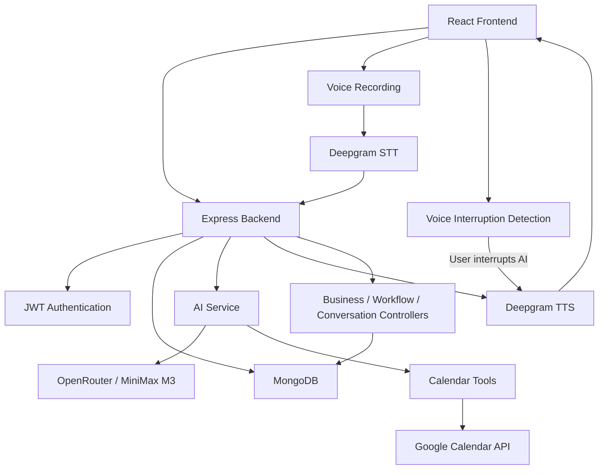

# CallFlow AI – Voice AI Personal Assistant

CallFlow AI is a configurable AI assistant for small businesses that handles missed-call conversations, collects customer information, manages follow-ups, and supports appointment scheduling through Google Calendar.

It provides both text and voice-based AI conversations with configurable business workflows.

---

## Features

### Business Profile

Business owners can configure:

- Business name
- Business type
- Phone number
- Description

### Custom Workflow Builder

Workflows can be created and edited without changing the application code.

Each workflow supports:

- Workflow name
- Missed-call trigger
- Greeting message
- Custom fields
- Required/optional fields
- Conditional branches
- Action after information collection
- Closing message
- Follow-up status

### AI Conversation

The AI assistant:

- Follows the configured workflow
- Collects customer information
- Understands customer intent
- Extracts structured information
- Generates contextual responses
- Maintains the conversation transcript
- Performs configured actions

### Voice Conversation

Voice mode uses Deepgram for Speech-to-Text and Text-to-Speech.

```text
User Speech
    ↓
Audio Recording
    ↓
Speech-to-Text
    ↓
AI Conversation
    ↓
AI Response
    ↓
Text-to-Speech
    ↓
Voice Playback
```

#### Voice Interruption / Barge-In

Users can interrupt the AI while it is speaking.

When the user starts speaking during AI playback:

1. User speech is detected.
2. Current AI audio playback is stopped.
3. The new speech is recorded.
4. Speech is converted to text.
5. The message is sent to the AI.
6. The AI generates an updated response.
7. The updated response is played back.

This allows a continuous conversational experience without waiting for the AI to finish speaking.

#### Voice Pause / Resume

The microphone button can be used to pause and resume the voice conversation.

When paused, recording and automatic listening are stopped. Clicking the microphone button again resumes the conversation.

### Google Calendar AI Tool Calling

Google Calendar is integrated as an AI tool.

The AI can:

- Check calendar availability
- Create calendar events
- Update/reschedule events
- Cancel/delete events

Calendar operations are implemented as separate tool functions and are invoked by the AI when required.

### Customer Conversations

Conversation records contain information such as:

- Caller name
- Caller phone number
- Business and workflow
- Conversation date/time
- Status
- Customer intent
- Captured information
- Summary
- Action
- Urgency
- Follow-up status
- Transcript

Conversation status can be updated to:

- Contacted
- Completed
- Closed

---

## Implemented Use Cases

### 1. Cake Shop

The Cake Shop workflow can collect information such as:

- Cake type
- Flavour
- Weight
- Required date
- Custom message
- Delivery/pickup preference
- Budget

### 2. Clinic / Appointment Booking

The Clinic workflow supports appointment-related conversations.

It can collect:

- Customer/patient name
- Service or appointment type
- Appointment date
- Appointment time
- Notes

The AI can check Google Calendar availability and create an appointment after the required information is collected and confirmed.

---

## Technology Stack

### Frontend

- React
- Vite
- JavaScript
- CSS

### Backend

- Node.js
- Express.js
- MongoDB
- Mongoose
- JWT
- HTTP-only refresh-token cookies

### AI & Voice

- OpenRouter
- MiniMax M3
- AI function/tool calling
- Deepgram Speech-to-Text
- Deepgram Text-to-Speech

### External Integrations

- Google Calendar API
- Google OAuth 2.0
- Deepgram API

---

## Architecture



---

## AI Conversation Flow

```text
Customer Message / Voice Input
            ↓
      Speech-to-Text
       (Voice Mode)
            ↓
   Workflow Configuration
            ↓
      AI Conversation
            ↓
   Information Extraction
            ↓
 AI Determines Required Action
            ↓
 Calendar Tool (if required)
            ↓
       Tool Result
            ↓
     AI Final Response
            ↓
      Text-to-Speech
       (Voice Mode)
            ↓
 Conversation / Customer Record
```

### Voice Interruption Flow

```text
AI Voice Playback
        ↓
User Starts Speaking
        ↓
Voice Detection
        ↓
Stop AI Audio
        ↓
Record User Speech
        ↓
Speech-to-Text
        ↓
AI Conversation
        ↓
Updated AI Response
        ↓
Text-to-Speech
        ↓
Voice Playback
```

---

## Database Models

### User

- `name`
- `email`
- `password`
- `refreshToken`

### Business

- `owner`
- `businessName`
- `businessType`
- `phone`
- `description`
- `googleCalendar`
  - `calendarId`
  - `connected`
  - `refreshToken`

### Workflow

- `business`
- `workflowName`
- `trigger`
- `greeting`
- `fields`
- `conditions`
- `closingMessage`
- `action`
- `followUpStatus`

### Conversation

- `business`
- `workflow`
- `callerPhone`
- `callerName`
- `intent`
- `capturedData`
- `summary`
- `action`
- `urgency`
- `followUpStatus`
- `status`
- `transcript`

---

## Project Structure

```text
backend/
├── controllers/
├── middleware/
├── models/
├── routes/
├── services/
└── server.js

frontend/
├── src/
│   ├── components/
│   ├── context/
│   ├── pages/
│   ├── services/
│   └── styles/
└── ...
```

The backend follows separation of concerns between routes, controllers, models, middleware, and services.

---

## Setup

### 1. Clone the Repository

```bash
git clone <your-github-repository-url>
cd VOICE-AI-ASSISTANT
```

### 2. Backend

```bash
cd backend
npm install
```

Create a `.env` file using `.env.example`.

Required variables:

```env
MONGO_URI=
JWT_SECRET=
JWT_REFRESH_SECRET=
OPENROUTER_API_KEY=
DEEPGRAM_API_KEY=
GOOGLE_CLIENT_ID=
GOOGLE_CLIENT_SECRET=
GOOGLE_REDIRECT_URI=
```

Start the backend:

```bash
npm start
```

Backend:

```text
http://localhost:5000
```

### 3. Frontend

```bash
cd frontend
npm install
```

Create the frontend environment file:

```env
VITE_API_URL=http://localhost:5000
```

Start the frontend:

```bash
npm run dev
```

Frontend:

```text
http://localhost:5173
```

---

## Google Calendar Setup

1. Create a Google Cloud project.
2. Enable the Google Calendar API.
3. Create OAuth 2.0 credentials.
4. Configure the OAuth redirect URI.
5. Add the Google Client ID, Client Secret, and Redirect URI to the backend `.env`.
6. Connect Google Calendar from the application.
7. The connected calendar is then available to the AI Calendar tools.

---

## Environment Variables

The environment-variable template is provided at:

```text
backend/.env.example
```

Never commit `.env` or secret API keys to GitHub.

When deploying the application, configure the required environment variables in the deployment platform.

---

## Current Status

### Working

- User signup and login
- JWT authentication
- Refresh-token flow using HTTP-only cookies
- Protected backend routes
- Business profile management
- Generic workflow creation and editing
- Custom workflow fields
- Required/optional fields
- Conditional workflow branches
- Text-based AI conversation
- Voice-based AI conversation
- Deepgram Speech-to-Text
- Deepgram Text-to-Speech
- Voice interruption / barge-in
- Automatic AI audio interruption
- Processing of interrupted user speech
- Continuous voice conversation
- Manual voice pause/resume
- AI information extraction
- AI-generated responses
- Google Calendar OAuth
- Calendar availability checking
- Calendar event creation
- Calendar event update/rescheduling
- Calendar event cancellation
- AI Calendar tool calling
- Conversation/customer records
- Conversation dashboard
- Conversation status updates
- Cake Shop workflow
- Clinic / appointment workflow

### Simulated

- Missed-call events are simulated through the application workflow/simulator.
- The current system does not connect to a real phone/SIP provider.

---

## Security

- Secrets are stored in environment variables.
- `.env` is excluded from Git.
- Authentication uses JWT and HTTP-only refresh-token cookies.
- Business and conversation resources use authenticated ownership checks.
- Google Calendar refresh tokens are stored server-side.
- AI and voice-service API keys remain on the backend.

---

## Production Improvements

Possible next steps for a production deployment include:

- Real phone/SIP integration for missed calls
- Production voice/telephony infrastructure
- Hindi or another Indian-language support
- Automatic language detection
- Email/SMS/WhatsApp owner notifications
- Background jobs and monitoring
- Rate limiting and additional validation
- Production deployment hardening
